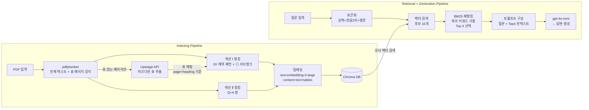

# 의료급여제도 RAG 파이프라인

> 2024 알기 쉬운 의료급여제도 PDF를 기반으로 한 RAG(Retrieval-Augmented Generation) 파이프라인 구축 및 평가

---

## 1. 사용 환경 및 기술 스택

| 항목 | 내용 |
|------|------|
| 실행 환경 | Windows 10, Python 3.10 |
| 프레임워크 | LangChain |
| 임베딩 모델 | OpenAI `text-embedding-3-large` |
| LLM | OpenAI `gpt-4o-mini` |
| 벡터 저장소 | Chroma (로컬 persistent) |
| 문서 파서 | Upstage Document Parse API, pdfplumber |
| 재랭킹 | BM25 (`rank-bm25`) |

---

## 2. 프로젝트 구조

```
monkana/
├── utils.py                      # 문서 파싱 및 청킹 파이프라인
├── RagMain.py                    # 벡터 DB 구성 및 평가
├── findChunk.py                  # 키워드 기반 청크 검색 유틸
├── all_chunks.json               # 파싱된 청크 (생성 파일)
├── document_parse_result.json    # Upstage API 캐시 (생성 파일)
├── evaluation_results.txt        # 평가 결과 (생성 파일)
├── chroma_db/                    # Chroma 벡터 DB (생성 폴더)
├── goldenDataset.jsonl           # 평가용 골든 데이터셋
└── 2024 알기 쉬운 의료급여제도.pdf
```

---

## 3. Golden Dataset 구축 과정

총 5개 질문을 설계하였으며 설계 시 고려한 점은 다음과 같습니다.

- **난이도 분산**: easy 2개, medium 2개, hard 1개로 구성하여 파이프라인의 다양한 조건에서의 성능 측정
- **조건 복합성**: 단순 키워드 검색으로 답할 수 없도록 수급권자 종류, 나이, 질병명, 의료기관 종류 등 복수 조건 조합
- **표 기반 답변**: 모든 질문의 정답이 PDF 내 표 데이터에서 도출되도록 설계하여 표 파싱 품질이 RAG 성능에 직접 영향을 미치도록 구성
- **evidence_text 정의**: 정답 근거가 되는 핵심 키워드를 명시하여 검색 성공 여부를 정량적으로 평가 가능하도록 함

---

## 4. RAG Indexing 파이프라인 구성

### 4-0. 파이프라인 구조도

> 아래 구조도는 claude.ai에서 렌더링됩니다. GitHub에서는 mermaid 버전을 참고해주세요.




### 4-1. 문서 파싱 전략

표 데이터가 포함된 PDF의 특성상 단순 텍스트 추출 시 셀 병합, 컬럼 관계 손실 문제가 발생합니다. 이를 해결하기 위해 두 파서를 역할에 따라 분리하였습니다.

- **pdfplumber**: 전체 텍스트 파싱 + 표 있는 페이지 사전 감지
- **Upstage Document Parse API**: 감지된 표 있는 페이지만 별도 PDF로 추출하여 한 번만 호출 → 표를 마크다운으로 변환, 결과를 JSON으로 캐싱하여 재호출 방지

**비용 절감 설계**: PDF 전체를 Upstage에 보내면 페이지 수만큼 비용이 발생하므로, pdfplumber로 표 있는 페이지만 먼저 감지한 뒤 해당 페이지만 추출해서 Upstage에 전달하는 방식을 채택하였습니다.

### 4-2. 2단 컬럼 레이아웃 대응

**문제**: PDF가 좌우 2단 컬럼 구조로 되어 있는데, pdfplumber가 전체 페이지를 대상으로 맨 왼쪽부터 맨 오른쪽까지 인식한 뒤 y좌표 기준 위→아래로 읽다 보니, 왼쪽 컬럼과 오른쪽 컬럼의 텍스트가 같은 y좌표 기준으로 뒤섞여서 읽히는 문제 발생. 즉 왼쪽 컬럼 한 줄, 오른쪽 컬럼 한 줄이 번갈아 나오는 형태로 추출되어 문서 구조가 완전히 무너짐.

**해결**: 페이지 너비의 절반(mid)을 기준으로 왼쪽 컬럼과 오른쪽 컬럼을 먼저 분리한 뒤, 왼쪽 컬럼을 위→아래로 완전히 읽고 나서 오른쪽 컬럼을 위→아래로 읽는 방식으로 변경. 이를 통해 2단 구조에서도 읽기 순서가 자연스럽게 유지됨.

```python
def extract_all_lines(page) -> list[str]:
    words = page.extract_words()
    mid = page.width / 2
    left_words = [w for w in words if w['x0'] < mid]
    right_words = [w for w in words if w['x0'] >= mid]
    # 왼쪽 컬럼 위→아래, 오른쪽 컬럼 위→아래 순으로 읽기
    left_words.sort(key=lambda w: (round(w['top'] / 5) * 5, w['x0']))
    right_words.sort(key=lambda w: (round(w['top'] / 5) * 5, w['x0']))
```

### 4-3. 청킹 전략

청킹 설계의 핵심 출발점은 **문서의 목차**였습니다. 목차를 보면 문서가 크게 섹션 Ⅰ(의료급여제도)과 섹션 Ⅱ(자주하는 질문)으로 나뉘고, 각 섹션의 구조적 패턴이 뚜렷하게 달랐습니다. 단순히 고정 크기로 텍스트를 자르는 방식 대신, **의미 단위로 청크를 구성**하는 것을 목표로 설계하였습니다.

**섹션 Ⅰ (의료급여제도)**

```python
def flush():
    chunks.append({
        "parent_section": get_parent_section(current_page, current_parent),
        "content": current_parent,
        "text": '\n'.join(current_texts).strip(),
        "tables": get_tables(current_page, current_parent),
        "page": current_page,
        "section": "Ⅰ. 의료급여제도",
    })
```

- 목차 구조를 반영하여 `^\d{2}\s+.+` 정규식으로 `0X 제목` 패턴 감지 → 새 청크 시작
- 이후 등장하는 본문 텍스트와 표를 해당 청크에 귀속
- `06 의료급여 2종수급권자 본인부담률` 항목은 하위에 치아 홈메우기, 분만 및 임신부, 15세 이하 아동, 정신질환 외래진료, CT/MRI/PET 등 의미상 독립적인 항목들이 많아 `◎` 패턴으로 추가 분리하여 서브청크 생성

**섹션 Ⅱ (자주하는 질문)**

```python
def flush():
    chunks.append({
        "parent_section": get_qa_section(q_num),
        "content": ' '.join(current_q_text).strip(),
        "text": ' '.join(current_a_text).strip(),
        "tables": [],
        "page": current_page,
        "section": "Ⅱ. 자주하는 질문",
    })
```

- Q+A 쌍을 하나의 의미 단위로 보고 `^Q(\d+)\.` 패턴으로 감지하여 청크 구성
- Q는 `content`(embed 대상), A는 `text`로 저장

**parent_section 매핑**

PDF에는 `01`, `02`, `03` 같은 번호가 여러 섹션에 걸쳐 반복됩니다. 번호만으로는 어떤 소주제에 속하는지 구분이 불가능하기 때문에 `page 번호 + 제목 번호 범위` 조합으로 `parent_section`을 결정하였습니다.

```python
PARENT_SECTION_RULES = [
    (3, range(1, 4),  "1. 의료급여제도 개요"),
    (4, range(1, 3),  "2. 의료급여 절차"),
    (5, range(1, 3),  "3. 의료급여 본인일부부담금"),
    (6, range(4, 7),  "3. 의료급여 본인일부부담금"),
    (7, range(7, 10), "3. 의료급여 본인일부부담금"),
    (7, range(1, 4),  "4. 2023년 변경된 의료급여제도"),
    (8, range(4, 9),  "4. 2023년 변경된 의료급여제도"),
    (8, range(1, 4),  "5. 의료급여기준 이력관리시스템"),
]
```

예를 들어 page 8에 `01 목적`, `02 주요 기능 및 내용`, `03 접속 경로`가 있으면 번호 범위 `range(1, 4)`에 해당하여 `5. 의료급여기준 이력관리시스템`으로 분류됩니다. 같은 `01` 번호라도 page에 따라 다른 `parent_section`으로 귀속되는 구조입니다. 그래서 청크 단위가 Ⅰ. 의료급여제도, Ⅱ. 자주하는 질문로 나뉘게 되고, 각 섹션 안에 포함된 대주제들은 1. 의료급여제도 개요, 2. 의료급여 절차 이런 형식으로 되어 있을텐데, 해당 대주제들에 해당하는 0X 제목 패턴의 주제들을 매칭시켜야 하는데 이를 PARENT_SECTION_RULE로 강제 매핑을 시켜 의미 단위 청킹이 올바르게 될 수 있도록 하였습니다.

**청크 구조 설계**

각 청크는 아래와 같은 구조를 갖습니다.

```json
  {
    "parent_section": "1. 의료급여제도 개요",
    "content": "02 의료급여 수급권자란?",
    "text": "◎ 의 료급여법에 의한 의료급여를 받을 수 있는 자격을 가진 사람을 말합니다.\n◎ 수 급권자 구분\n구분 대상\n• 국민기초생활보장 수급자\n- 근 로무능력가구, 시설수급자, 등록결핵질환자, 희귀질환자, 중증난치질환자,\n중증질환(암, 중증화상) 등록자\n• 타법적용자\n1종수급권자 - 이재민, 노숙인\n- 타법적용자 중 근로무능력자\n(의상자 및 의사자의 유족, 입양아동(18세미만), 국가유공자, 국가무형유산의\n보유자, 북한이탈주민, 5·18 민주화운동 관련자)\n• 행려환자\n2종수급권자 • 국민기초생활보장 수급자 및 타법적용자* 중 1종수급권자 기준에 해당되지 않는 자\n* 타법적용자 중 1·2종 구분은 ’23년 1월 1일 신규 수급권 신청자부터 적용",
    "tables": [
      "| 구분 | 대상 |\n| --- | --- |\n| 1종수급권자 | • 국민기초생활보장 수급자 - 근로무능력가구, 시설수급자, 등록결핵질환자, 희귀질환자, 중증난치질환자, 중증질환(암, 중증화상) 등록자 • 타법적용자 - 이재민, 노숙인 - 타법적용자 중 근로무능력자 (의상자 및 의사자의 유족, 입양아동(18세미만), 국가유공자, 국가무형유산의 보유자, 북한이탈주민, 5·18 민주화운동 관련자) • 행려환자 |\n| 2종수급권자 | • 국민기초생활보장 수급자 및 타법적용자* 중 1종수급권자 기준에 해당되지 않는 자 |\n"
    ],
    "page": 3,
    "section": "Ⅰ. 의료급여제도"
  },
  {
    "parent_section": "2. 의료급여 절차",
    "content": "Q7. 의 료급여 절차에 따른 의뢰 시, 의료급여의뢰서는 요양급여의뢰서 또는 의사소견서로 대체할 수 있나요?",
    "text": "의료급여의뢰서는 「의료급여법 시행규칙」별지 제3호 서식으로 발급하여야 하며 요양급여 의뢰서 또는 의사소견서 등으로 대체할 수 없습니다. ※ 관련근거 : 「의료급여법 시행규칙」제3조, 「2024 의료급여사업안내」",
    "tables": [],
    "page": 10,
    "section": "Ⅱ. 자주하는 질문"
  },
```

`section`과 `parent_section` 두 계층을 함께 저장함으로써 다음과 같은 장점을 가집니다.

- **소속 명확화**: 각 청크가 어떤 대주제(`section`), 어떤 소주제(`parent_section`)에 속하는지 명시되어 청크 단독으로도 문서 내 위치 파악 가능
- **필터링 활용**: 특정 섹션에 한정된 검색이나 분석 시 `section`, `parent_section` 기준으로 필터링 가능
- **디버깅 용이**: 검색 결과가 엉뚱한 청크를 가져올 때 `parent_section`을 보면 어느 영역에서 오류가 발생했는지 즉시 파악 가능

### 4-4. 표 → 청크 매핑 전략

pdfplumber(텍스트)와 Upstage(표)를 따로 파싱하다 보니 두 결과를 정확하게 연결하는 것이 핵심 과제였습니다.

**page 기준만 사용했을 때 문제**

같은 페이지에 청크가 여러 개 있는 경우 해당 페이지의 모든 표가 각 청크에 중복 배정됩니다.

```
page 3 → 청크: [01 의료급여제도란?, 02 의료급여 수급권자란?, 03 의료급여기관이란?]
page 3 → 표:   [수급권자 표, 의료급여기관 표]

결과: 세 청크 모두 표 2개씩 중복 배정 ← 문제
```

**heading 기준만 사용했을 때 문제**

Upstage가 표 있는 페이지만 받다 보니 중간에 heading이 없는 구간에서 표가 이전 heading에 계속 쌓입니다.

```
Upstage elements 순서:
  [heading] 03 의료급여 부당청구  (page 7)
  [table]   건강보험 비교 표      (page 19) ← 엉뚱한 페이지 표가 붙음
  [table]   제재대상 표           (page 20) ← 엉뚱한 페이지 표가 붙음
```

**해결 - page + heading 조합 방식 채택**

`(page 번호, normalize(heading 텍스트))`를 키로 하는 매핑 방식을 적용하였습니다. page로 1차 필터링하여 다른 페이지 표가 오염되는 것을 방지하고, heading으로 2차 매핑하여 같은 페이지 내에서도 정확한 청크에 표가 귀속되도록 구성하였습니다.

```python
# Upstage elements 순서 기반으로 (page, heading) → 표 매핑
current_key = (page, normalize(heading_text))  # 공백 제거 후 비교

# 같은 페이지 표만 귀속 (page 오염 방지)
if category == "table" and page == current_key[0]:
    tables[current_key].append(md)

# 조회 시
key = (page_num, normalize(chunk_title))
tables = tables_by_page_heading.get(key, [])
```

heading 텍스트 비교 시 `normalize()`로 공백을 제거하여 pdfplumber와 Upstage 간 텍스트 불일치 문제(`치 아 홈메우기` vs `치아홈메우기`)도 함께 해결하였습니다.

### 4-5. 임베딩 전략

```
page_content = content(제목/질문) + text(본문) + tables(마크다운 표, 600자 제한)
```

- 표 내용을 embed에 포함시켜 표 안의 키워드로도 검색 가능하도록 구성
- 원본 표 마크다운과 본문 텍스트는 `metadata`에 별도 보존하여 LLM 프롬프트 구성 시 활용

### 4-6. 검색 전략 (Vector + BM25 하이브리드)

**초기 방식 - 키워드 카운팅 재랭킹**

벡터 유사도로 후보 10개 추출 후 질문 키워드가 청크에 몇 개 포함되는지 카운팅하여 재정렬하는 방식을 사용하였습니다.

**문제**: 구어체 질문에서 `수급권자이고`, `환자인`, `찍었는데` 같은 조사/어미가 붙은 단어들이 키워드로 추출되어 엉뚱한 청크들이 높은 점수를 받는 문제 발생. 형태소 분석기 도입을 검토하였으나 `의료`, `급여`, `기관` 같은 일반적인 명사들이 점수를 오염시키는 문제 지속.

**해결 - BM25 하이브리드 검색 도입**

BM25(Best Match 25)는 단어 빈도와 희귀도를 동시에 고려하는 랭킹 알고리즘으로, 전체 코퍼스에서 희귀한 단어(`조현병`, `임플란트`, `협착증`)에 높은 점수를 부여하고 흔한 단어(`의료`, `급여`)에 낮은 점수를 부여합니다. 이를 통해 불용어 처리 없이도 자동으로 의미 있는 키워드 중심의 재랭킹이 가능합니다.

```
1. 벡터 유사도 검색으로 후보 10개 추출 (semantic 검색)
2. BM25로 후보 10개 재랭킹 (keyword 기반 희귀도 가중)
3. 상위 4개를 최종 컨텍스트로 LLM에 전달
```

토큰화 시 공백 단위 분리 외에 한글 2글자 이상 서브스트링과 영문을 별도 추출하여 `조현병`, `MRI`, `CT` 같은 핵심 키워드 매칭 정확도를 높였습니다.

```python
def tokenize(text: str) -> list[str]:
    tokens = text.split()
    korean = re.findall(r'[가-힣]{2,}', text)
    english = re.findall(r'[A-Za-z]+', text)
    return tokens + korean + english
```

---

## 5. 검색 품질 확인 결과

| 질문 ID | 난이도 | 검색 결과 | 예상 답변 | 모델 답변 | 답변 일치 |
|--------|--------|:-------:|---------|---------|:-------:|
| q01 | easy | O | 20% | 20% | O |
| q02 | easy | O | 무료 | 무료 | O |
| q03 | medium | O | 해당 되지 않음 | 해당 되지 않음 | O |
| q04 | medium | O | 60,000원 | 60,000원 | O |
| q05 | hard | O | 45,000원 | 45,000원 | O |

**검색 성공률: 5/5 (100%)**
**답변 일치율: 5/5 (100%)**

### 실패 원인 분석 (개선 과정)

최종적으로 5/5 모두 성공하였으나 개선 과정에서 다음과 같은 실패 사례가 있었습니다.

| 질문 | 초기 실패 원인 | 해결 방법 |
|------|-------------|---------|
| q03 | `text` 필드가 embed에 미포함 → `본인부담 보상제`, `상한제` 키워드 검색 실패 | `text` 필드를 embed 대상에 추가 |
| q04 | 표 내용이 embed에 미포함 → `협착증`, `디스크` 키워드 미매칭 | 표 내용을 embed에 포함 |
| q05 | `06` 항목이 단일 청크 → 조현병, CT/MRI 세부 항목 검색 불정확 | `◎` 기준 서브청크 분리 + BM25 재랭킹 도입 |

---

## 6. 인사이트 및 다음 단계

### 인사이트

- **표 파싱 품질이 RAG 성능에 직결**: pdfplumber 단독으로는 병합 셀 처리 실패. Upstage Document Parse 도입 후 표 구조 정확도 크게 향상
- **의미 단위 청킹이 핵심**: 고정 크기 분할 대신 문서 목차 구조를 반영한 의미 단위 청킹으로 검색 정확도 향상
- **embed 대상 설계가 중요**: 제목만 embed 시 표 내 키워드 검색 불가. content + text + tables 통합 embed로 검색 커버리지 확장
- **BM25 하이브리드 효과**: 구어체 질문에서 벡터 유사도만으로 놓치는 희귀 키워드를 BM25가 보완하여 검색 정확도 향상
- **PDF 레이아웃 대응**: 2단 컬럼 구조는 단순 y좌표 정렬이 아닌 컬럼 분리 후 순차 읽기 방식으로 해결

### 다음 단계

- **Generation 개선**: 단답 프롬프트 외에 근거 조항 함께 출력하는 프롬프트 설계
- **평가 확장**: 골든 데이터셋을 더 많은 난이도별 질문으로 확장하여 정량 평가 고도화
- **Q&A 청크 표 연계**: 현재 Q&A 청크에는 표가 없는데 관련 표 청크와 연결하는 방안 검토